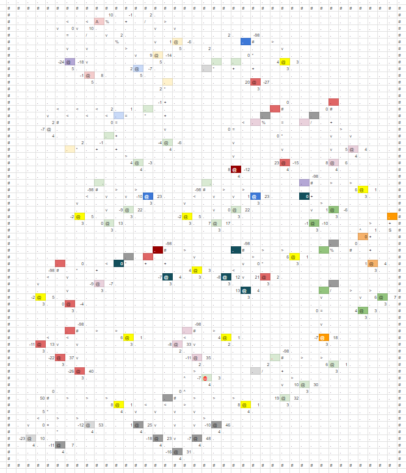

# Team manarimo

## Members

- Kenkou Nakamura (@kenkoooo): Ultimate Efficiency Manager
- mkut: Professional 3D-lang Player
- Osamu Koga (@osa_k): ICFP Assembly Engineer
- Shunsuke Ohashi (@pepsin_amylase): Lambdaman Lottery Engineer
- Yu Fujikake (@yuusti) Unemployed
- Yuki Kawata (@kawatea03): Spaceship Operator

### Writeups
[ja](./writeups/all.md) / [en](./writeups/all.en.md)

## Notable Products

- `amylase/base94.py`
    - Lambdaman solver
    - Despite its name, it performs dictionary-based compression of a Lambdaman path string.
    - Our primary score source of Lambdaman in the lightning round.
- `amylase/randomwalk.py` / `amylase/maze_search.py`
    - Lambdaman solver
    - Moves Lambdaman completely at random (up to the randomness of LCG 🙂), wishing that it accidentally solves the problem due to a cosmic miracle :spacecat:
    - Our primary score source of Lambdaman in the end.
- `osak/asm.rb`
    - ICFP assembler
    - Features: Human-readable string / number literals, comments, free formatting, totally optional use of parentheses that do not have any meaning other than relief to human eyes.
- `src/index.html` / `cli.py`
    - ICFP communicator interface
- `yuusti/lambdaman_greedy.cpp` / `yuusti/lambdaman_tree.cpp`
    - Lambdaman solver
    - Simple DFS with testing different priority for directions
    - Small optimization of solving tree
    - Builds a path to be fed to `amylase/base64.py`
- `3d-sim-web`
    - 3D-lang simulator
- `lambdaman-web`
    - Lambdaman simulator
- `kawatea/beam_tsp_order.cpp` / `kawatea/beam_tsp_order_one.cpp` / `kawatea/beam_sa.cpp`
    - Spaceship solvers
    - Sorts squares using TSP and finds the best path using Beam Search
    - Depending on the problem, one step of the Beam Search is different
    - The order of the squares are improved by Simulated Annealing
- `3d.txt` `3d.docs`
    - 
    - https://docs.google.com/spreadsheets/d/1PsRUmYwjU5lP0W4oxXrgw8kLn9NsBVN8KkMuG3GhTS0/edit?usp=sharing
    - 3d8~3d12 (lightning)

## Notable Solutions

- `lambdaman/ans/16.icfp`
- `osak/19.asm`
    - Carefully written ICFP programs to move Lambdaman along with the fractal path. What a fun!
- `lambdaman/ans/06.icfp`
- `lambdaman/ans/08.asm`
- `lambdaman/ans/09.icfp`
    - Gem of mankind’s ability to golf the program that has never been taken over by the lottery machine.
- `3d/ans/04.3d`
- `3d/ans/06.3d`
    - Global best solutions

## Strategies

### Lambdaman

- Hand assembly
- String compression
- Embedded RNG

Up to the lightning round, the main strategy was hand coding and string compression. The string compressor employs a dictionary based compression algorithm. Dictionary entries are fixed length for easy decoding.

We thought this was the best path… until we spotted unbelievably small number in the scoreboard. WHAT!? They seemed to go beyond the theoretical limit of the informational entropy for compression. Did they break the law of information, or is there any way around? It forced us to explore a new approach, and voila! we finally figured that implementing RNG in ICFP is a viable solution. It was honestly surprising for us that RNG worked THAT well for this kind of problem…

In the end, we combined RNG-based solution with manual enhancement; our RNG failed to pick up a few pills in some levels (especially in mazes) so we decided to inject a fragment of manually created sequence to recollect them during recursion. Unfortunately it was pretty close to the end of the contest and the scoreboard was frozen, so nobody knows how we did better than other rivals. God (and the contest organizers) only knows 🙂

### Lightning Round

Repository state at the end of the lightning round:  https://github.com/manarimo/ICFPC2024/tree/a8ba048461a4fd0cb8bacbe99c88592d1c86a534

I don’t remember exactly what we have done by the end of lightning round, but I think we’ve submitted solution to all problems except 3d11. String compression for Lambdaman was implemented and we were about to discuss some search algorithms for further improvement (and it was never made real).

## Overall Impression

This year’s contest was wonderful. We have to swear we got disappointed when the organizer announced there were no additional problems and extra specs. BUT… we soon figured that the organizer was REALLY good at balancing problems. In fact we have never bored throughout the contest yet we revealed all problems way before the lightning round was concluded. Fun problems and mechanics!
